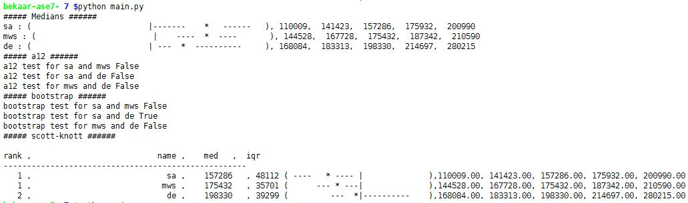

## HW 7 : Early termination and comparison of results from various algorithms

*  Akash Pandey
*  Abhishek Kumar
 

##Abstract

There are a number of meta-heuristic search based optimization algorithms. Since they are meta-heuristics, they guide the search path to an approximate solution to the problem, not necesserily to "the" 
solution. Sometimes these algorithms end up running longer durations and end up consuming resources without producing significantly improved solutions. Since all we ask for is approximate
solutions from these algorithms, it might not be worth it to keep running these algorithms for longer durations. In this work, we explore a few criteria for early termination of 
Simulated annealing(SA), MaxWalkSat(MWS) and Differential Evolution(DE) algorithms. We also present a comparison of performance of these algorithms with early termination using continuous
domination as performance measure and different statistical tests to ascertain the observed differences in performance.Expectedly, we find DE performs better then SA and MWS.

**Keywords**: Differential Evolution, Simulated Annealing, MaxWalkSat, DTLZ7, Statistical tests

##1. Introduction:

- some common about aall three algo and then details
- details three comparison operators
- Implementation details
- Problem with pareto frontiers
- Results: Image. And explaination 2-3 lines
- Conclusion-Which one is better. Some reasoning for being better. Some comment on how powerful it is.
- Threats to validity - 
- Future work

The search based optimization algirithms, including the ones used in this work, usually progress by randomly exploring the search space. They use some variant of _fitness function_ to 
quickly evaluate the point in a search space and then move on to the next point. However, all these algorithms do differ in certain important aspects of how they explore the search space.
Following is a brief summary of the three algorithms we have used in this work:

###1. Simulated Annealing(SA)

   This search algorithms is analogous to the process of physical annealing. It is useful for single objective optimization problems.
- The explorations starts off at a random point in the search space. It maintains a cache of three solutions at any time - the best seen so far, the current solution and the last solution.
- If we come across a better solution, we move to that point. 
- If we come across a worse solution, we move to that point with a probability P.
- The probability P depends on a _temperature_ values. Initially, temperature is high and we are more likely to jump to worse solutions. As search progresses, the temperature decreases and 
  we start avoing to jump to worse solutions.

###2. MaxWalkSat(MWS)

   This algorthm takes into account the local landscape of search space. The idea is slight modification on the mutation operation wihle searching. Instead of randomly moving to the next
point in the search space, we perform a local search for a better solution with a probability P. 
- The local search involves choosing one dimension and exploring just that one dimension for a better solution.
- Another concept introduced in this algorithm is that of retries. If we cannot find a good enough solution in our search space locally, we start all over again from a different point
  in the search space and start searching locally there.
- This is also a single objective optimization algorithms.

###3. Differential Evolution(DE):

   Differential evolution is a method that optimizes a problem by iteratively trying to improve a candidate solution with regard to a given measure of quality. It is useful for 
multi-objective optimization with possible multiple competing objectives. It generates a pareto frontier of solutions as output instead of a single solution. It optimizes without considering
the gradient of the objective function and hence finds wide applications.
- DE optimizes a problem by maintaining a population of candidate solutions and creating new candidate solutions by combining existing ones according to its simple formulae
- It retains the candidate which have the best score or fitness.
- Gradient is, thus, not a guiding factor in search space exploration.

### The optimization problem - DTLZ:

In this work, we try to find a set of optimal solutions for DTZ7 problem with 10 decisions and 2 objectives. DTLZ family of problems have been specifically written for the pupose of testing
multi-objective optimizers. The shape of pareto frontiers for these problems if known before hand and this fact helps researchers verify if their optimizer is working fine.

The pareto frontier for DTLZ7 consists of 2^(m-1) disconnected regions, where m is the number of objectives. So in our case of two objectives, a good optimizer will produde these two 
regions. We have based our implemtation of DTLZ7 on the one present in [Jmetal library](https://github.com/jMetal/jMetal/blob/master/jmetal-problem/src/main/java/org/uma/jmetal/problem/multiobjective/dtlz/DTLZ7.java).

[//]: # (TODO : Image of pareto frontier here. and possibly the equations.)

## Implementation details

Following are the major design challenges faced in the implementation:
- What termination criteria to use for each of the algorithms?
- How to generate a pareto front from Simulted annealing and MazWalkSat, so that we can have apple vs apple comparison between DE and these algorithms?
- Comparing the results from three algorithms

The implementation of the three algorithms is based on the standard version as provided on the course website.

###1. Termination criteria

We run the algorithms in eras of 100 steps as suggested in the homework specifications. In our initial experiment, we terminated our algorithms as soon as we stop observing any improvemnt
in best solution from the previous era. This did not always generate best results. We attribute this behaviour simply to the fact that - since all these algorithms  perform stochastic search
it can be just a one-off incident that we didn't observe any improvement. So we modified our approach to something called Krall's Bstop method. We came across this techiniques in last year's
course website. 

#### Krall's Bstop method:

The technique works as follows:
1. Initialize the algorithm some number of lives, say k lives.
2. After every era, look for any improvement in objectives. 
3. If no improvemnt, then decrement the number of lives by one else reset number of lives to k.
4. Terminate when no lives left.

Another important aspect of implemting early termination is determinint improvement:

1. **SA** : As long as the _best so far_ is improving as compared to previous era, we call it improvement and keep giving more lives to algorithm
2. **MWS** : Here, every _retry_ makes one era. If we improve on the best known, as compared to last retry, we call it as improvement and give lives to algorithm.
3. **DE** : For DE, we have used the Type 2 comparator that performs the a12 test on the current pareto frontier. If the difference between pareto frontier from last era and current era is 
   is not a small effect, we call it improvement and give more lives to algorthm.

###2. Generating Pareto frontier from SA and MWS

SA and MWS are single objective optimizers and produce only a single _optimal_ solution as output. Multi-objective optimization problems usually have multiple optimal solutions. One solution
perform better on certain objectives and others perform better on another set of objectives. One can choose the solution based on the priority of objectives or any other domain specific 
requirement. To generate a set of solution instead of single solution, we run SA and MWS multiple times with different seed, hoping to get a differnt optimal solution each time. We call 
these solution as the _Pareto frontier_ generated by the SA and MWS. Note that, these might not be a good representation of pareto frontier for the problem, but this, atleast is a set of 
optimal solutions for the problem.

###3. Comparing results from the three algortihms

We use continuous domination loss between the first and last generation as parformance measure for comparison. Further we use the Type 1, 2 and 3 comarators imvolving median score
comparison, effect size test using a12 algirithm and the bootstrap test for hypothesis testing. To generate a ranking of optimizers, we have used Scott-Knott test.

## Results

The results from the experiments are summarized above. Note that, the greater the loss (in absolute value) between from first to last generation, the better the optimizer.
- At the top are the median value of cdom lossed represented visually along with the quintiles. It can be observed the DE has the highest loss and hence the best performance.
- The second result in the image is a12 effect size test. We can see that the results are false for each of the pair indicating the difference in performance is a small effect.
- Further we perform bootstrap test, which is also `false`. on some repetitions of the bootstrap test we got `true`. This, however, is insignificant be cause the differences are a small 
  effect.
- Finally we have the results of the Scott-Knott test. SA and MWS are ranked similarly, while DE ranks higher. 

The results from the experiments are as per expectation. SA and MWS are not very well suited for multi-objective optimizations. When optimizing a multi-objective problem with SA or MWS
essentially we optimize the weighted sum of objectives. Add to that the effect of early termination, we end up with sub-optimal solutions as comparedto DE.

## Conclusion

During the course of experiment, we have discovered that Krall's Bstop method is an effective way to implement early termination in search based optimizers. On the contrary, abruptly 
terminating the algorithm may lead to poor results. We have also ascertained that DE performs better for the given multi-objective optimization problem. SA and MWS have inherent issues
in generating a pareto frontier of optimal solutions for such a problem.

## Threats to validity

Our experiments and hence the associated conclusions are based on certain assumptions and design choices which may pose a threat to validity of our results.

- We have run our experiments on a single model - DTLZ7. The results may vary with different models and different number of decisions and objectives in the model. Hence the results we have
  claimed cannot be generalized yet to all kinds of optimization problems with any number of decisions and objectives.

- Throughout our experiments, we have used just one value for `lives` (5). Giving lesser number of lives may terminate the algorithms earlier without affecting the solutions much or, it may
  also produce worse results. Similarly giving more life may (or may not) improve our result. Different values need to be experimented with.

- We have used only cdom losses as performance measure. Different permormance measures like change in hypervolume, IGD etc can be used to fortify the results.

## Future work

- There have been considerable number of papers proposing different ways to use SA for multi-objective optimization. One such paper is:

  [Multiobjective Simulated Annealing: A Comparative Study to Evolutionary Algorithms](http://citeseerx.ist.psu.edu/viewdoc/download?doi=10.1.1.74.2194&rep=rep1&type=pdf) - Dongkyung Nam and Cheol Hoon Park

  The paper discusses several approaches for dealing with multi-objective optimation in SA. We would like to implement a few  of these and look for the possibility of improvent in out
  results.

- Their have been studies on different approaches for early termination. Some of them are quite similar to our approach. But still, they need to be studied to see if we did any better than
  those. One such paper is:
  [A convergence criterion for multiobjective evolutionary algorithms based on systematic statistical testing](http://www.academia.edu/11765222/A_convergence_criterion_for_multiobjective_evolutionary_algorithms_based_on_systematic_statistical_testing)

- As a more obvious work, we would like to remove some of the issues mentioned in the threats to validity section.

## References

[1] [ASE'16 Course Website](https://github.com/txt/ase16/blob/master/README.md)

[2] [JMetal library](https://github.com/jMetal/jMetal)

## Acknowledgement

Special thanks to our TA, George Mathews, for guiding us in the right direction, specially in Homework 7. We had completely misunderstood problem earlier.
