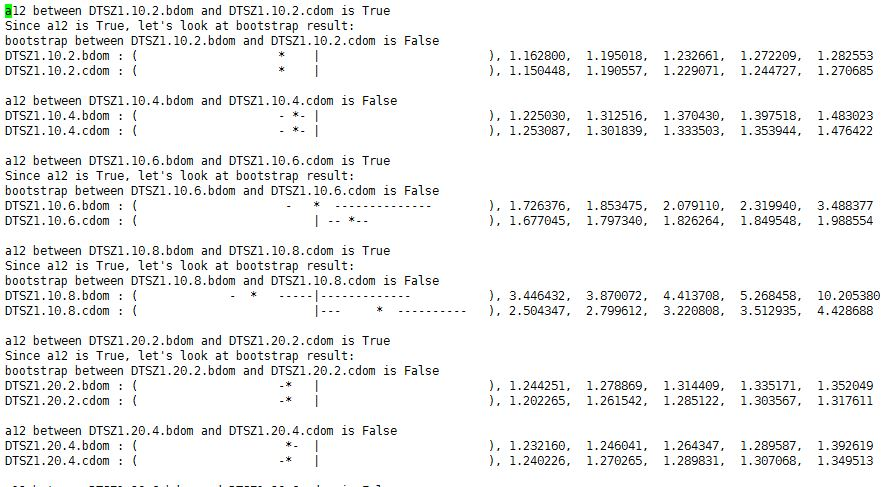

## HW 8 : Implemment NSGA-II

*  Akash Pandey
*  Abhishek Kumar
 

##Abstract

The Elitist Non-dominated Sorting Genetic Algorithm or NSGA-II algorithm is a faster variant of the classic Genetic algorithm technique. It has fast selection operator compared to its
predecessors, which significantly improves the overall performance. We have implemented the non-dominated sorting using binary domination as well as continuous domination. Implementation
with continuous domination was more challenging and it lead us to some of the corner cases of the algorithms. We ended up slightly modifying the algorithm to account for the corner cases.
As a general trend, we have seen binary domination variant perform slightly better on problems with lesser number of objectives.

**Keywords**: Genetic algorithms, Non-dominated sort, continuoous domination, binary domination, crowd pruning

##1. Introduction:

Genetic algorthm is a multi-objective evolutionary algorithm (MOEA) inspired from the process of natural selection. Traditinally, it is suited for binary data but it has been modified and 
successfully adopted for other types of data as well. It consits of:

- Initialization - Generating an initial population of candidate solutions. Each decision is represented as a gene in chromosome. 
- Crossover - Selecting some decision values from both the parents
- Mutation - Randomly modifying one or more of the decision values in child
- Selection - Selecting a subset of current population based on the values of some fitness function
- Termination - Stopping after some number of generations or when desired value of optimization is reached in population.

The selection operation can be a major bottleneck since it is run over entire population multiple times. NSGA-2 proposes a selection based _domination rank_:

- It sorts the population based on number points a given point is dominated by. 
- Divides the population into ranks. Each rank comprises individuals dominated by same number of individuals. Each such ranks forms a _frontier_.
- In order to select K best individuals, 
	- keep selecting every individual in each frontier until we reach a frontier where, selecting all the individuals would lead us to exceed k.
	- Perform secondary sort for crowd pruning in that frontier and select as many as needed from that frontier.

The secondary sorting technique used is called _cuboid sorting_.

### The fast non-dominated sort

Following is an optimized implementation non-dominated sorting used in NSGA-2:


_np_: number of candidates that dominate p (the upstream counter)
_Sp_: candidates dominated by p (the downstream set)
_F1_: frontier 1 (the frontier of things dominated by no one)

### Crowd pruning - Cuboid sort

The cuboid sort algorithm for ssecondary sorting works as follows:

+ For each objective,
   + Sort the candidates on that objective
   + For each candidate _p_ in that "too much" frontier,
      + Find the _gap_ equal to the sum of the space
        _up_ and _down_ to the next candidate
      + Normalize _gap_  by the max-min in that objective.
      + Add _gap_ to _I<sub>p</sub>_
+ Sort candidates by _I<sub>p</sub>_
  + Discard the smaller ones. 

The intution of this approach is to choose fewer individuals from more crowded spaces to get a better representation of solutions in from different parts of the search space and develop
a richer and diverse solution set.

### Models

We have used a a great variety of models from the DTLZ family.  DTLZ family of problems have been specifically written for the pupose of testing multi-objective optimizers. The shape of 
pareto frontiers for these problems is known before hand and this fact helps researchers verify if their optimizer is working fine.

Specifically, we have used DTLZ1,3,5 and 7 with 10, 20 and 40 decisions and 2, 4, 6 and 8 objectives. This gives us a total of 4x3x4 = 48 different problems to work with.

## Implementation details

We had the following major challenges to deal with in the implementation:

- Implementing classic GA. Modifying the selection operator to that used in NSGA-2. Implement bdom and cdom.
- Dealing with corner cases in NSGA-2 non-dominated sorting algorithms
- Choosing default parameters for GA
- Choosing a performance measure
- Dealing with large runtime of the whole experiment.

###1. Basic implementation of GA and NSGA-2

We used the GA example code developed in workshop 1 and modified its selection operator. It should be noted that our GA for this homework uses single-point crossover. 

We based our implementation of _non-dominated sort_ and _cuboid sort_ exactly as mentioned in the lecture notes. The binary domination implementation is same as the one in workshop GA code.
The continuous domination function is also implemented based on the pseudo-code in the lecture notes.

###2. Dealing with corner cases in NSGA-2 non-dominated sort

Our implementation worked well with binary domination + cuboid sort based selection and we got expected results. However, in the cdom based selection, we were getting incoherent result 
which were widely different from those seen in bdom case. On further investigation, we found that - sometimes, the numeber of individuals across all frotiers returned by 
non\_dominated\_sort() function is less than the number of individuals in the population sent as input to the function.

In one extreme case, we got lesser number of individuals than the `retain_size` parameter value and our program terminated. 

This was happening because, in the `fast_non_dominated_sort` pseudocode above, it is implicitly assumed that the ranks will be consecutive. In other words, the algorithm assumes that
every consecutive numbered frontier will have atleast one individual. This was not the case in our counter example and hence the algorthm failed when it found an empty frontier before 
processing all the points in the population. This case crept up only in cdom variant and not in bdom. This is primarily because of the nature of cdom. 

- If _a_ dominates _b_, and _b_ dominates _c_, it doesn't necesserily mean that _a_ dominates _c_. It is not transitive.
- For each pair of candidate solutions _a_ and _b_, with real numbered values for objectives, it is extremely likely that _a_ dominates _b_ or _b_ dominates _a_ in case of cdom. However,
  in bdom, it is quite possible that non of them dominate each other. This leads to less crowded, and possobly empty frontiers.

We modified the algorithm as follows:

```python
def fast_non_dom_sort(problem, population, better=utils.bdom):
    mypop = [FrontierPt(decisions = X) for X in population]
    frontiers = [[]]
    for p in mypop:
        p_obj = problem.get_objectives(p.decisions)
        for q in mypop:
            if q.id == p.id: continue
            q_obj = problem.get_objectives(q.decisions)
            if better(problem, p_obj, q_obj):
                p.s.append(q)
            elif better(problem, q_obj, p_obj):
                p.n += 1
        if not p.n:
            p.rank = 1
            frontiers[0].append(p)

	#Our Changes to deal with first frontier being empty
	####################################################
    if len(frontiers[0]) == 0:
       #print("Frontier 0 is empty")
       sorted_pop = sorted(mypop, key = lambda X: X.n)
       smallest_rank = sorted_pop[0].n
       i=0
       while sorted_pop[i].n == smallest_rank:
           frontiers[0].append(sorted_pop[i])
           i+=1
    i = 0
    num_added = len(frontiers[0])
    num_needed = len(population)
    while len(frontiers[i]):
        Q = []
        for p in frontiers[i]:
            for q in p.s:
                q.n -= 1
                if not q.n:
                    q.rank = i + 2
                    Q.append(q)

		#Our changes when one of the frontier in between is empty			
		#########################################################
        if not len(Q) and num_added < num_needed:
            continue
        i += 1
        frontiers.append(Q)
        num_added += len(Q)

	#Assertion to check if we are missing any other corner case
    assert(sum([len(front) for front in frontiers]) == len(population))
    return [[frontier_pt.decisions for frontier_pt in frontier] for frontier in frontiers]

```

Our modified algorithm has two major changes - one to deal with the case when first frontier is empty and second to deal with the case when a frontier in between is empty.
This modified version worked fine with the same inputs which failed earlier.

### Selecting a performance measure

We have used the ratio of hypervolume between the initial and the final population produced by the algorithm. We have used the improved hypervolume implementation proposed by Fonseca et. al.
[here](http://lopez-ibanez.eu/doc/FonPaqLop06-hypervolume.pdf). This version of hypervolume estimation, altough slower, but gives much better results and allows us to discern and compare
optimizers. The monte-carlo based hypervolume estimation technique, that we used earlier, always produced a hypervolume value of 1 irrespective of the optimization algorithms and hence
provided no way to compare the results. We did not use IGD here as would have had to run this using diffrent optimizers to generate the _ideal_ pareto frontier as a step before, which could 
have been more time consuming.

### Choosing default parameters

The default parameter chosen here are:

- Mutation rate : 0.01
- Selection - NSGA-2 based
- Populations size - 100
- Number of generations- 45
- Crossover - Single point

These were chosen based on the code developed in GA workshop. Since, we had to optimize these in HW9 anyways, so we didn't experiment with different values.

### Running the large number of experiments

We performed our experiment on 48 variants of DTLZ functions running each of them 20 times using bdom and cdom based selection. We chose the Fonseca Hypervolumme as our performance measure.
The hypervolume can be very slow especially with large number of objectives. It was taking a large amount of time to finish even a subset of these experiments on our laptops. So, we used 
the power of [VCL](https://vcl.ncsu.edu/). We ran our experiments on multiple nodes parallely. We left them on overnight. 

To further speed up experiments, we used the raw compute power provided by the [ARC](http://moss.csc.ncsu.edu/~mueller/cluster/arc/) cluster hosted at NCSU. We used 4 machines with 12 
processors each. Hence, each processor was dedicated to one (of the 48) DTLZ variants. This made pur experiments run extremely fast.

**Caching** : To further speed up the experiment, we cached the result of initial hypervolume calculations between the bdom and cdom variant of a problem. Hence the time required to compute
hypervolume of the inital pupulation was halved.

## Results



The image above represnts a subset of the results obtained. All the results can be seen [here](output/all.stats). 

The general trend in the result is : bdom variant performs slightly better than cdom variant when the number of objectives is small. This can be attributed to the fact that - with larger
number of objectives the frontiers become more and more crowded in case of bdom. The likelihood of two points not dominating each other becomes very high with increasing number of objectives.
However, in cdom, given two points, one of them is highly likely to dominate the other irrespective of the number of objectives.


## Conclusion

- We successfully handled the corner cases that were highlighted when using NSGA-2 with cdom. In general, it is hard to identify and deal with such corner case.
- Hyperovolume estimator used by us is prohibitively slow in some case and can seriously hit the speed of the experiment.
- The behaviour of binary and continuous domination is highlighted by varyiing the nummber of objectives. Hence it is advisable to test any optimizers on different variety of problems.
- Lastly, look for any scope for caching (or dynamic programming) to speed-up otherwise slow and tedious experiments.

## Threats to validity

Our experiments and hence the associated conclusions are based on certain assumptions and design choices which may pose a threat to validity of our results.

- We have made modifications to the base NSGA-2 algorithm and assumed correctness based only on empirical evidence. More rigorous mathematical analysis is needed to ascertain the effect of 
  our modifications.
- We have used fixed, default parameters for our GA. So our observations based on the results may not be generally true for any set of parameters.
- Our implementation code can be buggy as it has not been tested thoroughly enough.

## Future work

- A more thorough analysis of mathematical correctness of our variation of NSGA-2 needs to be done.
- Some mathematical proof of non-transitive nature of cdom is also worth  doing. The only proof now we have involve a counter example.
- As a more obvious work, we would like to remove some of the issues mentioned in the threats to validity section.

## References

[1] [ASE'16 Course Website](https://github.com/txt/ase16/blob/master/README.md)

[2] [JMetal library](https://github.com/jMetal/jMetal)

