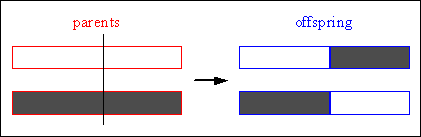
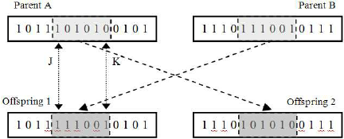
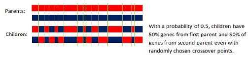
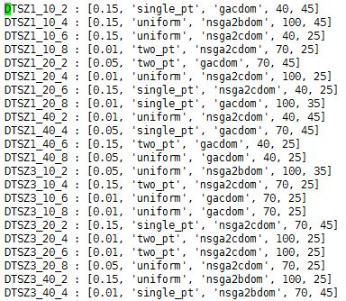

## HW 9 : Hyper parameter optimization

*  Akash Pandey
*  Abhishek Kumar
 

##Abstract

Using one optimizer to optimize the input parameters to another optimizers is an intereting idea but it can lead to long runtimes of the meta-optimizer. In this case our meta-optimizer is
Differential Evolution(DE) and we use it to obtain input parameter values for Genetic algorithm based optimizer. We use  three possible candidates for each of the five parameter values 
for GA. We come up with significantly improved performance of GA using these parameter.

**Keywords**: Genetic algorithms, Differntial evolution, hyper parameter optimization

##1. Introduction:

Genetic algorthm is a multi-objective evolutionary algorithm (MOEA) inspired from the process of natural selection. Traditinally, it is suited for binary data but it has been modified and 
successfully adopted for other types of data as well. It consits of:

- Initialization - Generating an initial population of candidate solutions. Each decision is represented as a gene in chromosome. 
- Crossover - Selecting some decision values from both the parents
- Mutation - Randomly modifying one or more of the decision values in child
- Selection - Selecting a subset of current population based on the values of some fitness function
- Termination - Stopping after some number of generations or when desired value of optimization is reached in population.

Each of these oprators offer one or more parameters which can take a number of values. Our goal is to come with a _best_ set of values for these parameters. We have chosen to optimize the 
following five parameters:

- Mutation rate
- Crossover type
- Selection operator
- Population size
- Number of generations

We provide three choices for each of these parameters. So our complete search space comprises of 3^5 = 243 points. We find ten of the best points out of these 243 using DE. Then we compare 
the results of optimized vs optimized versions of these algorithms.

### Models

We have used a a great variety of models from the DTLZ family.  DTLZ family of problems have been specifically written for the pupose of testing multi-objective optimizers. The shape of 
pareto frontiers for these problems is known before hand and this fact helps researchers verify if their optimizer is working fine.

Specifically, we have used DTLZ1,3,5 and 7 with 10, 20 and 40 decisions and 2, 4, 6 and 8 objectives. This gives us a total of 4x3x4 = 48 different problems to work with.

## Implementation details

We use the base GA implementation from HW8 and adorned it to take the above mentioned parameters and input.

We had the following major challenges to deal with in the implementation:

1. Selecting and implementing different crossover operators
2. Selecting and implementing different selection operators
3. Performance measure for GA
4. Removing redundant computations to speed-up
5. Running experiments 

###1. Crossover

Crossover involves choosing a subset of genes from both the parents to come up with the child chromosome. In other words, it involves choosing some decision values from one parent and some
from other to a new candidate solution. There are a number of possible ways to choose the decisions from parents. We have used the following three:

####i. Single-point crossover

In this approach, for a population comprising of points with n decisionss, we take the first half of decision vector from pne parent and decond half from the other.

####ii. Two point crossover

In two point crossover, we select two random indices in the decision vector and exchange the contents between these two indices amon the two parents.

####iii. Uniform crossover

In this type, we pick every decision with a probability 0.5 from each of the parent.

###2. Selection

It involves selecting a subset of current population based on the values of fitness function.  We have used the following three alternatives for selection operation:

####i. NSGA2 with binary domination

This is same as the standard NSGA2 algorithm. It uses binary domination as the criteria for determining better candidates.

####ii. NSGA2 with continuous domination

This is same as the standard NSGA2 algorithm. It uses continuous domination as the criteria for determining better candidates.

####iii. Selection using CDOM sort

In this approach, we first sort all the individuals based on number of individuals dominated by them. The domination criteria used is continuous domination. Then we select top candidates
from the set of sorted values.

###3. Performance measure for GA

We have used the ratio of hypervolume between the initial and the final population produced by the algorithm. We have used the improved hypervolume implementation proposed by Fonseca et. al.
[here](http://lopez-ibanez.eu/doc/FonPaqLop06-hypervolume.pdf). This version of hypervolume estimation, altough slower, but gives much better results and allows us to discern and compare
optimizers. The monte-carlo based hypervolume estimation technique, that we used earlier, always produced a hypervolume value of 1 irrespective of the optimization algorithms and hence
provided no way to compare the results. We did not use IGD here as would have had to run this using diffrent optimizers to generate the _ideal_ pareto frontier as a step before, which could 
have been more time consuming.

###4. Removing redundant computation

Since running DE with GA as objective function involves runnning GA multiple times with different parameters, it becomes a very long and slow process. We found out some redundant computations
that could be cached between different runs of GA:

1. Since our search space for DE is limited consisting of just 243 points, we are quite likely to hit the same point again and end up performing the GA computation again. So we cached the
   GA evaluation results with input parameters as key. 

2. Initial hypervolume computation do not depend upon the input parameters and hence can be cached for the complete run of DE with a given seed for random numbers.

3. The minimum and maximum values of objective needed for normalization were also cached for the duration of DE.

For comparing the results of optimized parameters against the default ones, we reused the results with default parameters in HW8.

###5. Running experiments

We performed our experiment on 48 variants of DTLZ functions, ran DE for each of them and compared results with non-optimized parameters by running the experiment 20 times. We chose the 
Fonseca Hypervolumme as our performance measure.  The hypervolume can be very slow especially with large number of objectives. It was taking a large amount of time to finish even a subset
of these experiments on our laptops. So, we used the power of [VCL](https://vcl.ncsu.edu/). We ran our experiments on multiple nodes parallely. We left them on overnight. 

To further speed up experiments, we used the raw compute power provided by the [ARC](http://moss.csc.ncsu.edu/~mueller/cluster/arc/) cluster hosted at NCSU. We used 4 machines with 12 
processors each. Hence, each processor was dedicated to one (of the 48) DTLZ variants. This made our experiments run extremely fast.

## Results

The above images shows a subset of the best parameter values generated by running DE for each
of the 48 variants DTLZ. The complete results can found [here](output/best_params.txt). Note
that DE provided a pareto frontier of 10 optimal points for each of the variant. We decided to
choose the ones that gave the best hypervolume ratio. We can observe that completely different
set of input parameters have been chosen different objective type.

The above image  shows a subset of the results of comparison between optimized and 
non-optimized versions of GA. The complete results can be viewed 
[here](output/comparison_results.txt) Each experiment was repeasted 20 times. It is clear that
we have obtained orders of magnitude better performance in optimized versions for most cases. 
Optimized version is never worse when compared to non-optimized versions. The effect test
yeild a positive result everytime indicating that the difference is not a small effect.
The massive improvement in hypervolume ratio values in optimized versions is in part
attributed to the way in which they are calculated by Fonseca's hypervolume estimation
algorithm. The improvement in quality of solution is definitely present but not in the 
proportion indicated by the hypervolume ratio values.

## Conclusion

We successfully found better input parameter values for GA and observed significant 
improvements in performance. This techinique is indicative of a general approache with
wide applications. Essentially, we can use DE to optimize any other process for which we 
have to choose input parameters and the best values cannot be easily determined or
have to be guessed.

We also observed that exploiting the opprtunities to cache results in hyperparameter
optimization can same a lot of precious computation time.

## Threats to validity

Our experiments and hence the associated conclusions are based on certain assumptions and design choices which may pose a threat to validity of our results.

- We have chosen a set of parameters for DE based on some good suggested values. It does
  not guarantee our choices are the best ones for this problem. Although, different paramete
  choices may not lead to significantly different results. 
- In order to generalize our conclusion that DE can be used to tune any process, more i
  empirical evidence might be needed. We need to try it on different optimizers.
- Our implementation code can be buggy as it has not been tested thoroughly enough.

## Future work

- Trying DE with different input parameters and find the ones that give good optimization
  in less  time as time is a critical factor in hyperparamete optimization.
- Building upon the learnings from this homework, use this approach for optimizing other 
  algorithms.
- Make the process fast enough so that we can provide a larger search space to DE.
- As a more obvious work, we would like to remove some of the issues mentioned in the threats to validity section.

## References

[1] [ASE'16 Course Website](https://github.com/txt/ase16/blob/master/README.md)

[2] [JMetal library](https://github.com/jMetal/jMetal)

